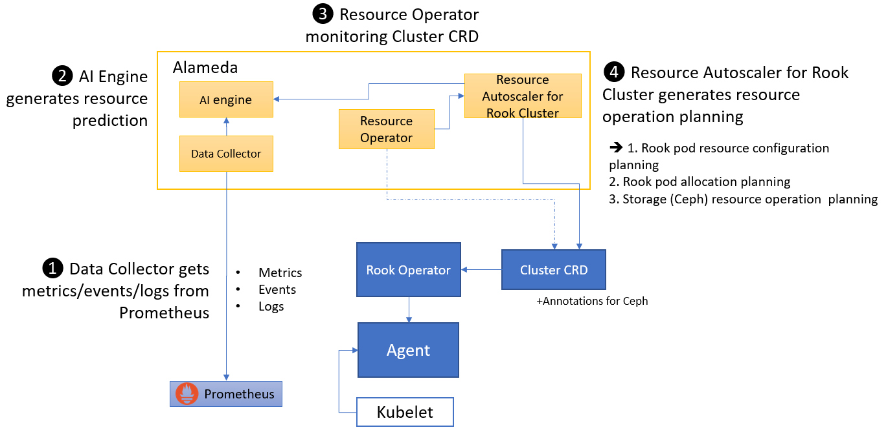

## What is Alameda

Alameda is an intelligent resource orchestrator for Kubernetes, providing the features of autonomous balancing, scaling, and scheduling by using machine learning. Alameda learns the continuing changes of computing and I/O metrics from clusters, predicts the future demands for pods, and intelligently orchestrates underlying resources to fulfill the dynamic resource requests without manual configuration.

For more details, please refer to https://github.com/containers-ai/Alameda

## Features

Alameda provides Rook with the following features:

The main purpose of Alameda is to provide prediction and planning to Rook. Rook can make decsions and take actions based on prediction and planning.

- Disk health prediction  
    Based on a disk's S.M.A.R.T. value, Alameda predicts how bad a commodity disk is going to fail in a near future. Rook can stop provisioning volumes from a critical status disk.
- Performance prediction  
    Alameda learns patterns from the historical performance metrics of persistent volumes and pools. With this knowledge, 
    for basic features:
    - Prediction-based Pod (CPU and memory) requests and limits configuration
    
This approach has the following benefits:
    - have more efficient pod resource configuration planning
    - have more efficient pod allocation planning
    - provision volumes from low loading pool
    - recommend disk replacement time
- Capacity trending prediction  
    Alameda can also provide capacity usage trending prediction for Rook's storage providers as well as storages exposed by Rook. Rook knows better **when** to add more disks or more nodes for more capacity.

## How Alameda works

1. Alameda data collector gets metrics from Prometheus (e.g. CPU, memory, Ceph metrics). No Alameda Agent is needed.
2. Alameda AI engine generates resource prediction
3. Alameda update cluster CRD: (1) update CRD spec, or (2) update CRD spec with new definitinos of planning
    No matter they are (1) or (2), Rook needs to change the logic of watching CRD
3. Alameda resource operator monitors Rook cluster CRD
4. Alameda generates resource operation planning for Rook cluster

