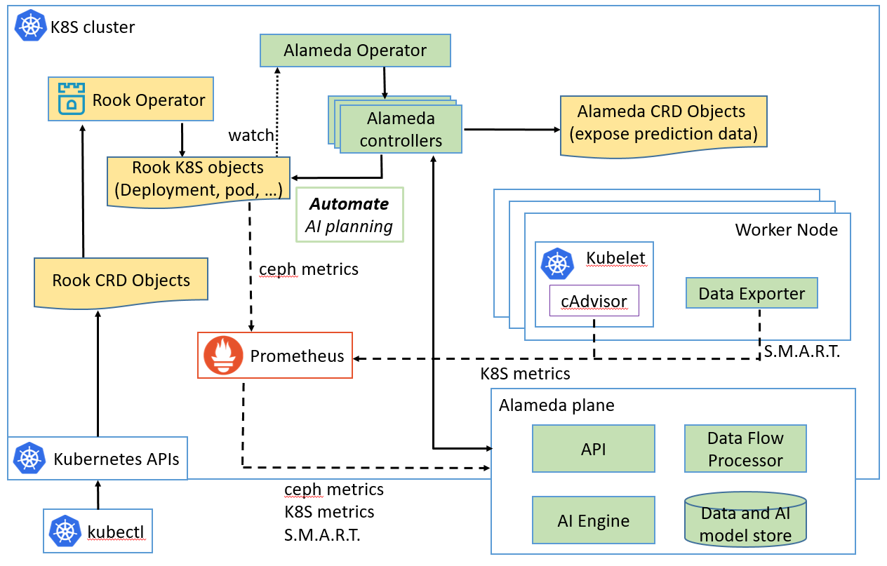

## What is Alameda

Alameda is an intelligent resource orchestrator for Kubernetes, providing the features of autonomous balancing, scaling, and scheduling by using machine learning. Alameda learns the continuing changes of computing resources from K8S clusters, predicts the future computing resoruce demands for pods and nodes, and intelligently orchestrates the underlying computing resources without manual configuration.

For more details, please refer to https://github.com/containers-ai/Alameda

## Features

The main purpose of Alameda is to orchestrate computing resources for Kubernetes by utilizing AI-powered prediction capability. With this, IT admins can leave one of the hardest problems of running Kubernetes to Alameda. 

Our first take is to provide the following features, which we consider they are beneficial for Rook. 
- Disk health and life expectancy prediction  
    Based on a disk's S.M.A.R.T. value, Alameda predicts how bad a commodity disk is going to fail in a near future. Rook can stop provisioning volumes from a critical status disk.
    
- Automatic resource configuration for pods  
    Alameda includes a community edition AI Engine which generates loading data in the future time. The AI Engine learns patterns from the historical performance metrics of each node and pods running on it. For example, it predicts CPU metrics of the next 24 hours in 1-hour interval. With this prediction info of nodes and pods, Alameda can automatically configure pod resource settings without human intervention. Alameda will provide the following features:

    - Continuously automate compute resources (i.e., CPU and memory) requests and limits configurations for pods. It takes both a node and pods running on this node into consideration. For Rook, it means users don't need to configure for pods of mgr, mon, and osd.
    - Recommend predicted low loading time window for a predicted bad disk replacement

## How Alameda works

1. Alameda watches objects which need Alameda service  
Proposal 1: by adding Alameda annotations to Rook CRD objects  
Proposal 2: by creating Alameda CRD objects to specify users' K8S deployment objects.

2. Alameda utilizes prometheus to scrape data, and these data is adapted into Alameda plane  
Alameda does not have data collection agent.

3. Alameda AI engine generates resource prediction  

4. Alameda exposes prediction raw data via Alameda CRD objects  
For example, with these prediction, Rook can (1) update CR spec, or (2) update CR spec with new definitions of planning.

5. Alameda automates AI planning based on these prediction raw dataa  




## Request Alameda services by annotating Rook CRD objects (Proposal 1)

Rook users deploy a ceph cluster by creating a Rook CRD cluster object. Rook operator will create _Deployment_, _ReplicaSet_ and _Pod_ objects subsequently according to this cluster object. All these subsequent objects can be traced back to the Rook CRD cluster object by looking into the _ownerReferences_ metadata. To request Alameda services, Rook users can annotate a Rook CRD cluster object with Alameda annotations. For example, Rook users can add ```containers.ai/autoscale```, ```containers.ai/diskFailurePrediction``` and ```containers.ai/capacityTrendingPrediction``` annotations in their *cluster.yaml* as:
<pre>
    apiVersion: ceph.rook.io/v1beta1
    kind: Cluster
    metadata:
      name: rook-ceph
      namespace: rook-ceph
      <b>annotations:
        containers.ai/autoscale: true
        containers.ai/diskFailurePrediction: true
        containers.ai/capacityTrendingPrediction: true</b>
    spec:
      dataDirHostPath: /var/lib/rook
      serviceAccount: rook-ceph-cluster
      storage:
        useAllNodes: true
        useAllDevices: true
</pre>

Then Rook operator will create a _Deployment_ object such as:
<pre>
    apiVersion: apps/v1beta1
    kind: Deployment
    metadata:
      annotations:
        deployment.kubernetes.io/revision: "1"
      creationTimestamp: 2018-09-24T06:59:25Z
      generation: 5
      labels:
        app: rook-ceph-osd
        ceph-osd-id: "1"
        rook_cluster: rook-ceph
      name: rook-ceph-osd-id-1
      namespace: rook-ceph
      ownerReferences:
      - apiVersion: v1beta1
        blockOwnerDeletion: true
        kind: Cluster
        name: rook-ceph
        uid: e1ec433a-96f4-11e8-b01a-0a168aa5aac2
      resourceVersion: "11765632"
      selfLink: /apis/extensions/v1beta1/namespaces/rook-ceph/deployments/rook-ceph-osd-id-1
      uid: 5f21a46e-bfc7-11e8-8e77-0645df3fb718
</pre>

By tracing back the _ownerReferences_ information, Alameda knows users request Alameda services.

## Request Alameda services by creating Alameda CRD objects (Proposal 2)

When Rook users create a Rook cluster CRD object, Rook operator may create an _Deployment_ object with the following yaml:
<pre>
    apiVersion: apps/v1beta1
    kind: Deployment
    metadata:
      name: rook-ceph-osd-id-1
      namespace: rook-ceph
      labels:
        app: rook-ceph-osd
        ceph-osd-id: "1"
        rook_cluster: rook-ceph
    spec:
        ...
</pre>
meanwhile, Rook operator needs to also create an Alameda CRD object as the following yaml to request Alameda for services:
<pre>
    apiVersion: containers.ai/v1beta1
    kind: Deployment
    metadata:
      <b>annotations:
        containers.ai/autoscale: true
        containers.ai/diskFailurePrediction: true
        containers.ai/capacityTrendingPrediction: true</b>
    spec:
      <b>selector:
        matchLabels:
          app: rook-ceph-osd
          ceph-osd-id: "1"
          rook_cluster: rook-ceph</b>
</pre>

