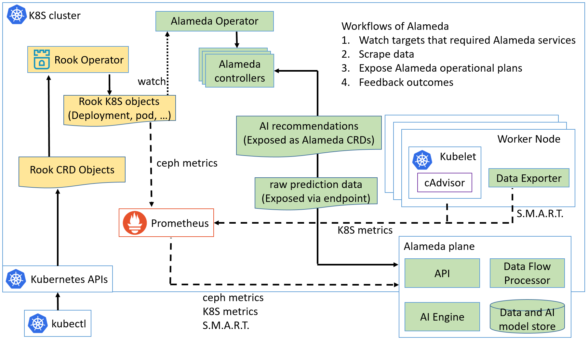

## What is Alameda

Alameda is an intelligent resource orchestrator for Kubernetes, providing the features of autonomous balancing, scaling, and scheduling by using machine learning. Alameda learns the continuing changes of computing resources from K8S clusters, predicts the future computing resources demands for pods and nodes, and intelligently orchestrates the underlying computing resources without manual configuration.

For more details, please refer to https://github.com/containers-ai/Alameda

## Features

The main purpose of Alameda is to orchestrate computing resources for Kubernetes by utilizing AI-powered prediction capability. With this, IT admins can leave one of the hardest problems of running Kubernetes to Alameda. 

Our first take is to provide the following features, which we consider they are beneficial for Rook. 
- Disk health and life expectancy prediction  
    Based on a disk's S.M.A.R.T. value, Alameda predicts how bad a commodity disk is going to fail in a near future. Rook can stop provisioning volumes from a critical status disk.
    
- Automatic resource configuration for pods  
    Alameda includes a community edition AI Engine which generates loading data in the future time. The AI Engine learns patterns from the historical performance metrics of each node and pods running on it. For example, it predicts CPU metrics of the next 24 hours in 1-hour interval. With this prediction info of nodes and pods, Alameda can automatically configure pod resource settings without human intervention. Alameda will provide the following features:

    - Continuously automate compute resources (i.e., CPU and memory) requests and limits configurations for pods. It takes both a node and pods running on this node into consideration. For Rook, it means users don't need to configure for pods of mgr, mon, and osd.
    - Recommend predicted low loading time window for a predicted bad disk replacement

## How Alameda works

The Alameda works in the following flows:

1. Users specifying objects that need Alameda services by creating Alameda CRD objects  
    When Rook users create a Rook cluster CRD object, Rook operator may create a _Deployment_ object with the following yaml:
    <pre>
        apiVersion: apps/v1beta1
        kind: Deployment
        metadata:
          name: rook-ceph-osd-id-1
          namespace: rook-ceph
          labels:
            app: rook-ceph-osd
            ceph-osd-id: "1"
            rook_cluster: rook-ceph
        spec:
            ...
    </pre>
    To request Alameda services for this _Deployment_ object, Rook operator also needs to create an Alameda CRD object as the following yaml:
    <pre>
        apiVersion: containers.ai/v1beta1
        kind: Deployment
        metadata:
          <b>annotations:
            containers.ai/autoscale: true
            containers.ai/diskFailurePrediction: true
            containers.ai/capacityTrendingPrediction: true</b>
        spec:
          <b>selector:
            matchLabels:
              app: rook-ceph-osd
              ceph-osd-id: "1"
              rook_cluster: rook-ceph</b>
    </pre>

2. Alameda watches creation, update, and deletion of the specified targets

3. Alameda leverages Prometheus to scrape data, and these data is adapted into Alameda plane  
Alameda does not have data collection agent.

4. Alameda's AI engine predicts computing resource demands  

5. Alameda exposes prediction raw data  
With these predictions, Rook can (1) update CR spec, or (2) update CR spec with new definitions of planning.

6. Alameda generates operational plans based on the prediction for further automation 

7. Third party projects such as Rook can automate resource orchestrations by either leveraging Alameda recommended operational plans or generating their own operational plans from the prediction raw data  

8. Alameda has a feedback mechanism to evalute the operation results for further refinement

