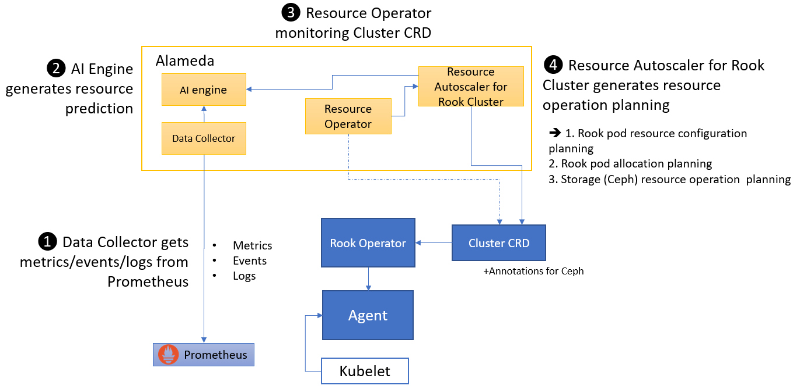

## What is Alameda

Alameda is an intelligent resource orchestrator for Kubernetes, providing the features of autonomous balancing, scaling, and scheduling by using machine learning. Alameda learns the continuing changes of computing and I/O metrics from clusters, predicts the future demands for pods, and intelligently orchestrates underlying resources to fulfill the dynamic resource requests without manual configuration.

For more details, please refer to https://github.com/containers-ai/Alameda

## Features

Alamada provides Rook with the following features:

- Disk health prediction
    Based on a disk's S.M.A.R.T. value, Alamada predicts how bad a commodity disk is going to fail in a near future. Rook can stop provisioning volumes from a critical status disk.
- Performance prediction
    Alamada learns patterns from the historical performance metrics of persistent volumes and pools. With this knowledge, Rook can:
    - have more efficient pod resource configuration planning
    - have more efficient pod allocation planning
    - provision volumes from low loading pool
    - recommend disk replacement time
- Capacity trending prediction
    Alamada can also provide capacity usage trending prediction for Rook's storage providers as well as storages exposed by Rook. Rook knows better **when** to add more disks for more capacity.

## How Alamada works

1. First Alamada data collector gets metrics, events, and logs from Prometheus
2. Alamada AI engine generates resource prediction
3. Alamada resource operator monitors Rook cluster CRD
4. Alamada generates resource operation planning for Rook cluster

